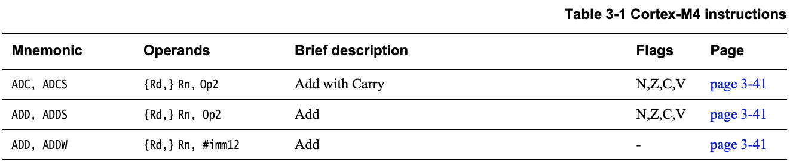

# ARM Assembly Primer

While it's impossible to give a meaningful overview of ARM assembly in a single
brief document, this primer aims to serve as a crash course or reminder of some
of the key concepts in ARM Thumb or Thumb-2 assembly language programming.

The main target of this primer is **ARM Cortex-M** devices, which employ
several different versions of the ARM architecture and instruction set,
depending on the device selected:

| Instruction Set    | Associated ARM Cortex Device(s) |
| ------------------ | ------------------------------- |
| ARMv6-M (Thumb)    | ARM Cortex M0, ARM Cortex-M0+   |
| ARMv7-M (Thumb-2)  | ARM Cortex-M3                   |
| ARMv7E-M (Thumb-2) | ARM Cortex M4(F), ARM Cortex M7 |
| ARMv8-M (Thumb-2)  | ARM Cortex M23, ARM Cortex M33  |

For technical resources on the various architectures see:

- [ARM v6-M Architecture Reference Manual](https://static.docs.arm.com/ddi0419/d/DDI0419D_armv6m_arm.pdf)
- [ARM v7-M Architecture Reference Manual](https://static.docs.arm.com/ddi0403/eb/DDI0403E_B_armv7m_arm.pdf)
- [ARM v8-M Architecture Reference Manual](https://static.docs.arm.com/ddi0553/a/DDI0553A_e_armv8m_arm.pdf)

For a comprehensive treatment on the subject see:

- [Modern Assembly Language Programming with the ARM Processor](https://www.elsevier.com/books/modern-assembly-language-programming-with-the-arm-processor/pyeatt/978-0-12-803698-3),
Larry D. Pyeatt (Newnes, 2016)
- [ARM Assembly Language, 2nd Edition](https://www.oreilly.com/library/view/arm-assembly-language/9781482229851/),
William Hohl (CRC Press, 2016)

## ARM User Registers

Like most modern processor designs, ARM cores require that values be stored in
local general-purposes registers before they can be operated upon.

#### General Purpose Registers

ARM processors have 13 general-purpose 32-bit registers (`r0` through `r12`),
and three special-purpose 32-bit registers (`r13-r15`):

|Register|Description|
|--------|-----------|
|R0| General-purpose register 0 |
|R1| General-purpose register 1 |
|R2| General-purpose register 2 |
|R3| General-purpose register 3 |
|R4| General-purpose register 4 |
|R5| General-purpose register 5 |
|R6| General-purpose register 6 |
|R7| General-purpose register 7 |
|R8| General-purpose register 8 |
|R9| General-purpose register 9 |
|R10| General-purpose register 10 |
|R11 (`fp`)| General-purpose register 11 / Frame pointer|
|R12 (`ip`)| General-purpose register 12 / Inter-procedure scratch register|
|R13 (`sp`)| Stack pointer |
|R14 (`lr`)| Link register |
|R15 (`pc`)| Program counter |

The three special purpose registers are:

- The **program counter** (`R15`) contains the address of the next instruction
  to be executed by the ARM core. This register will be incremented before
  after an instruction is executed, enabling sequential program flow unless
  a different value is written to this register, cause the code to jump to the
  newt address.
- The **link register** (`R14`) contains the return address for subroutines,
  which usually holds the `pc` value from the previous function call so that
  the application can return to the calling address once execution of the
  function has completed.
- The **stack pointer** (`R13`) holds the address where the stack currently
  ends. As stack usage increases, this number will decrease towards the top
  of the stack (though logically it seems like the bottom since the stack
  'grows' downward).

Additionally, there are two registers that are used by high-level languages by
convention, though this isn't mandatory in assembly:

- The **inter-procedure scratch register** (`R12`) is used by the C library
  when calling DLL functions.
- The **frame pointer** (`R11`) maybe be used by some compilers to track the
  current stack-frame.

#### Current Program Status Register (CPSR)
In addition to the 15 standard user registers, there is an additional register
of note called the `CPSR` (Current Program Status Register):

|Register|Description|
|--------|-----------|
|CPSR| Current Program Status Register |

This register is used to indicate a variety of important information, some of
which is only easily accessible in assembly.

The CPSR has four key **condition flag bits** that make up the upper four bits
of the register:

- Bit 31 **N** (Negative): 1 = signed result is negative, 0 = positive or zero.
- Bit 30 **Z** (Zero): 1 = result is zero, 0 = result is non-zero.
- Bit 29 **C** (Carry): 1 if an `add` operation resulted in a carry out of the
  MSB or if a `sub` operation resulted in a borrow.
- Bit 28 **V** (Overflow): Set to 1 if a signed `add` or `sub` overflow occured.

> For details on the other CPSR bits, consult the official ARM documentation or
  one of the ARM assembly books mentionned in this guide.

## ARM Instructions

An ARM assembly instruction is made up of a short **mnemonic** (a short string
representing a base instruction plus any optional modifiers), and a set of
**operands**, which can be either registers or constants.

The image below, for example, shows the `ADD` mnemonic family, along with it's
operands, and is taken from section 3.1 of  *Cortex-M4 Instruction Set* from
ARM:



Above you can see the **condition flags** modified by the `s` variant of these
commands (see *The s Modifier* below for details), the list of operands
associated with the said mnemonics, and some notes on what the specific
mnemonic does.

Operands and mnemonic formation are discussed in more detail in subsequent
sections.

### Instruction Types

Before discussing the use of ARM instructions, though, it's important to note
that there are two main *types* of instructions on the ARM processor, and by
design they are rigidly separated from one another:

- **Load/Store** instructions that **move data from the CPU to memory or back**.
- **Data-processing** instructions that **perform computation**

Load/store operations can work with up to 32-bits of data in 8, 16 or 32-bit
chunks, transferring values to and from registers and memory.

Data-processing instructions are performed via two **source operands** and one
**core register** (`R5`, `R8`, etc.). Data-processing instructions operate on
the assumption that the core register(s) already contain data, generally moved
into the register via a load instruction, or pushed out to memory via a store
instruction.

It's important to keep these two instruction types in mind, since they have
consequences in the discussion below.

### Mnenomic Formation

Individual ARM mnemonics are actually a composite of up to three parts:

1. The base instruction (ex. `add`)
2. An optional **s modifier** (ex. `adds`)
3. An optional **condition modifier** (ex. `addeq`)

> NOTE: The two optional modifiers can also be combined (i.e.. `addseq`).

This system of a base instruction plus up to two modifiers allows for a rich
and flexible set of operations, using a relatively restrained number of overall
instructions.

#### 1. The Base Instruction

The base instruction is self-explanatory, and is fully detailed in the
appropriate *Cortex-M<x> Instruction Set* document from ARM.

The more important concept to explore here is the two optional **modifiers**
that can be added to this base instruction, detailed below.

#### 2. The s Modifier

The **s modifier** is related to the `CPSR` register discussed above. By
default `CPSR` will not be used when executing individual instructions, but you
can append the `s` modifier to an assembly command, which will cause the core
to enable usage of `CPSR` for that instruction.

For example, the `add` command will add two 32-bit values. If you append the
`s` modifier to the command -- resulting in `adds` -- the condition
code flags will also be updated based on the result of the operation.

#### 3. Condition Modifiers

There are also a number of two-letter **condition modifiers** that are
employed by appending them to the base instruction mnemonic:

| Cond Code | Condition Flags  | Meaning for data instructions |
|-----------|------------------|-------------------------------|
| `EQ`      | Z = 1            | Equal                         |
| `NE`      | Z = 0            | Not equal                     |
| `CS`/`HS` | C = 1            | Carry condition flag set      |
| `CC`/`LO` | C = 0            | Carry condition flag clear    |
| `MI`      | N = 1            | Negative                      |
| `PL`      | N = 0            | Positive or zero              |
| `VS`      | V = 1            | Overflow set                  |
| `VC`      | V = 0            | Overflow not set              |
| `HI`      | C = 1 and Z = 0  | Unsigned higher               |
| `LS`      | C = 0 or Z = 1   | Unsigned lower or same        |
| `GE`      | N =  V           | Signed greater than or equal  |
| `LT`      | N != V           | Signed less than              |
| `GT`      | Z = 0 and N = V  | Signed greater than           |
| `LE`      | Z = 1 and N != V | Signed less than or equal     |

For example, taking the `add` instruction we could append the `eq` condition
modifier, which would result in an add instruction that only executes if the
`Z` condition flag is set.

> Note: Conditional modifiers can **also be combined with the `s` modifier**.

There is one final condition modifier worth mentionning, though it's rarely
seen since this is the default modifier used when nothing else is specified:

| Cond Code | Description                |
|-----------|----------------------------|
| `AL`      | Always (normally ommitted) |

As an example, the code below makes use of the `MI` conditional instruction to
find the absolute value of a number: `R0 = abs(R1)`.

```
MOVS  R0, R1      ; R0 = R1, setting flags
IT    MI          ; skipping next instruction if value 0 or positive
RSBMI R0, R0, #0  ; If negative, R0 = -R0
```

### Operands

Operands can be either an **immediate value** (a *constant* with specific
constraints), or a **register**.

Registers are relatively self-explanatory, but immediate values may required
some further explanation, given below.

#### Immediate Values

Immediate values in ARM can be constant values that are part of the instruction
itself, or can be accessed from the *literal pool*.

They can be specified in one of the following 8/16/32-bit numeric formats:

- **decimal**
- **octal** (must start with `0`, ex. `03`)
- **hexadecimal** (must start with `0x`, ex. `0x2F`)
- **binary** (must start with `0b`, ex. `0b11010010`)

There are two syntaxes used to specify immediate values in GNU:

1. `=<immediate|symbol>`: Specifies a 32-bit immediate value, or the 32-bit
  value of any symbol in the program. `symbol` can be either program labels (`main`, etc.) or symbols defined via `.equ`, etc. This syntax is used for
  **load/store** instructions.
2. `#<immediate|symbol>`: Can be used to specify values for **data processing**.

> For the distinction between *load/store* and *data-processing* instructions,
  see *ARM Instruction Types* below.

A key restriction of the `=` syntax is that **it can only be used with the
load/store instructions**, never with data-processing instructions, although unlike
the `#` syntax, it can accept more than eight bits of data.

A key restriction of the `#` syntax is that the assembler needs to be able to
construct the value using only:

    - Eight bits of data
    - A shift or rotate operation
    - and/or a complement

Immediate values that can't meet the `#` limitations must be created using a
`ldr` instruction in combinations with the `=<immediate|symbol>` syntax when
indicating the value.


### Examples

TODO: Document a couple examples highlight the above concepts!
